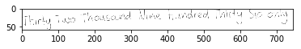
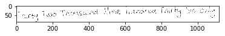
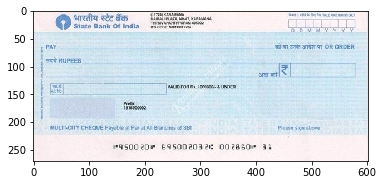
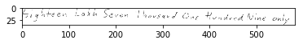
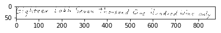
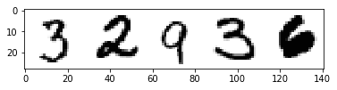
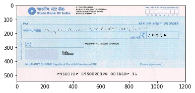
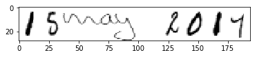
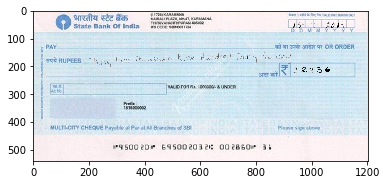

# SBI CHEQUE VALIDATION USING DEEP NEURAL NETWROK

##                                                        TEAM
###                                           ANUBHAV, VIJENDRA, NEERAJ , ASHUTOSH

## HOW TO RUN:-

### to combine splited files in windows

cd into yolo-data
copy /b file1 + file2 + file3 + file4 filetogether.tar.gz
uncompress filetogether.tar.gz


### How to combine splited files in Ubuntu
cd into yolo-data
cat final-data.tar.gz* | tar xz


### How to  split  big files in Ubuntu
tar cvzf - final-data | split -b 10m - final-data.tar.gz


### darknet commands and YOLO for object detecction
yolo training on 3000 images and with 8000 iteration  

Currently training is still going  on GPU cluster in background mode, lets see after 1 day:-
/datadrive/NeerajAg/yolo/darknet

We tried pretrain darknet model to train further using below command:-
https://pjreddie.com/darknet/yolo/

train:-
./darknet detector train cfg/obj.data cfg/yolo.cfg darknet19_448.conv.23
nohup  ./darknet detector train cfg/obj.data cfg/yolo.cfg  backup/yolo.backup  > training.log &

Test:-
./darknet detector test cfg/obj.data  cfg/yolo.cfg backup/yolo-obj_final.weights /home/ashutosh/sentienceWork/darknet/final-data/final-image-0.jpg -thresh 0

See yolo training log 
Region Avg IOU: 0.481528, Class: 0.994299, Obj: 0.242427, No Obj: 0.004990, Avg Recall: 0.333333,  count: 3
7556: 9.163102, 6.318862 avg, 0.001000 rate, 0.095384 seconds, 7556 images
Loaded: 0.000055 seconds

6.318862 avg loss is too high as per yolo it should be below 0.06 to 0.6

./darknet detector train cfg/obj.data  cfg/yolo-obj.cfg yolo.weights

/home/ashutosh/sentienceWork/darknet/final-data/final-image-0.jpg


/darknet detector train cfg/obj.data cfg/yolo.cfg darknet19_448.conv.23

./darknet detector test cfg/obj.data  cfg/yolo.cfg backup/yolo-obj_final.weights /home/ashutosh/sentienceWork/darknet/final-data/final-image-0.jpg -thresh 0


```python
import cv2
import matplotlib.pyplot as plt
import matplotlib.image as mpimg
%matplotlib inline

```

## Adding Amount in words


```python
s_img = cv2.imread("in-words-images-transparentBG/0.png", -1)

height, width = s_img.shape[:2]

s_img2 = cv2.resize(s_img, (int(width/1.5), int(height/1.5)), interpolation = cv2.INTER_AREA)

plt.imshow( s_img2)
```


    <matplotlib.image.AxesImage at 0x7faefaf172e8>





```python
plt.imshow( s_img)
```


    <matplotlib.image.AxesImage at 0x7faefae574e0>





```python
s_img=s_img2
```


```python
l_img = cv2.imread("cheque.jpg")
l_img = cv2.cvtColor(l_img, cv2.COLOR_BGR2RGB)
plt.imshow( l_img)
```


    <matplotlib.image.AxesImage at 0x7faefade21d0>





```python

height2, width2 = l_img.shape[:2]
dst = cv2.resize(l_img, (2*width2, 2*height2), interpolation = cv2.INTER_CUBIC)
plt.imshow( dst)
```


    <matplotlib.image.AxesImage at 0x7faef939a908>





```python


x_offset= 200 
y_offset=150
#l_img[y_offset:y_offset+s_img.shape[0], x_offset:x_offset+s_img.shape[1]] = s_img

#s_img = cv2.imread("smaller_image.png")

y1, y2 = y_offset, y_offset + s_img.shape[0]
x1, x2 = x_offset, x_offset + s_img.shape[1]

alpha_s = s_img[:, :, 3] / 255.0
alpha_l = 1.0 - alpha_s
dst2=dst
for c in range(0, 3):
    dst2[y1:y2, x1:x2, c] = (alpha_s * s_img[:, :, c] +
                              alpha_l * dst2[y1:y2, x1:x2, c])
    
plt.imshow( dst2)
```


    <matplotlib.image.AxesImage at 0x7faef91524a8>





## Adding number in box


```python
num_img = cv2.imread("Combined_transparent/number_0.png", cv2.IMREAD_GRAYSCALE)

height, width = num_img.shape[:2]
#num_img = cv2.resize(num_img, (int(width/2), int(height/2)), interpolation = cv2.INTER_AREA)
print(num_img.shape)
#num_img_show = cv2.cvtColor(num_img,cv2.IMREAD_GRAYSCALE)
plt.imshow( num_img ,cmap='gray')

```

    (28, 141)


    <matplotlib.image.AxesImage at 0x7faef905f9b0>





```python
x_offset= 930 
y_offset=200
#l_img[y_offset:y_offset+s_img.shape[0], x_offset:x_offset+s_img.shape[1]] = s_img

#s_img = cv2.imread("smaller_image.png")

y1, y2 = y_offset, y_offset + num_img.shape[0]
x1, x2 = x_offset, x_offset + num_img.shape[1]

alpha_s = num_img[:, :] / 255.0
alpha_l = 1.0 - alpha_s
dst3=dst2
for c in range(0, 3):
    dst3[y1:y2, x1:x2, c] = (alpha_l * num_img[:, :] +
                              alpha_s * dst3[y1:y2, x1:x2, c])
    


plt.imshow( dst3)
dst4 = cv2.cvtColor(dst3, cv2.COLOR_BGR2RGB)
cv2.imwrite("final-image.jpg", dst4)

```


    True





```python
#dst2 = cv2.cvtColor(dst2, cv2.COLOR_RGB2BGR)
```


```python
cv2.imwrite("final-image.jpg", dst3)
```


    True


# adding date


```python
from PIL import Image
import os

folder_path_input = "dates/"
folder_path_output= "dates-transparentBG/"

"""

image_names =os.listdir(folder_path_input)

for img_name in image_names:
    print (img_name)
    img = Image.open(folder_path_input+img_name)
    img = img.convert("LA")
    datas = img.getdata()

    newData = []
    for item in datas:
        if item[0] == 255 :
            newData.append((255,  0))
        else:
            newData.append(item)
    #os.chdir(folder_path_output)
    img.putdata(newData)
    img.save(folder_path_output+img_name, "PNG")
"""
```


    '\n\nimage_names =os.listdir(folder_path_input)\n\nfor img_name in image_names:\n    print (img_name)\n    img = Image.open(folder_path_input+img_name)\n    img = img.convert("LA")\n    datas = img.getdata()\n\n    newData = []\n    for item in datas:\n        if item[0] == 255 :\n            newData.append((255,  0))\n        else:\n            newData.append(item)\n    #os.chdir(folder_path_output)\n    img.putdata(newData)\n    img.save(folder_path_output+img_name, "PNG")\n'


```python

```


```python
date_img = cv2.imread("dates-transparentBG/date_0.png",  cv2.IMREAD_GRAYSCALE)

height, width = date_img.shape[:2]
date_img = cv2.resize(date_img, (int(width/1.5), int(height/1)), interpolation = cv2.INTER_AREA)
plt.imshow( date_img ,cmap='gray')

```


    <matplotlib.image.AxesImage at 0x7faef8f7ceb8>





```python
x_offset= 930 
y_offset=40
#l_img[y_offset:y_offset+s_img.shape[0], x_offset:x_offset+s_img.shape[1]] = s_img

#s_img = cv2.imread("smaller_image.png")

y1, y2 = y_offset, y_offset + date_img.shape[0]
x1, x2 = x_offset, x_offset + date_img.shape[1]

alpha_s = date_img[:, :] / 255.0
alpha_l = 1.0 - alpha_s
dst4=dst3
for c in range(0, 3):
    dst4[y1:y2, x1:x2, c] = (alpha_l * date_img[:, :] +
                              alpha_s * dst3[y1:y2, x1:x2, c])
    


plt.imshow( dst4)
dst5 = cv2.cvtColor(dst4, cv2.COLOR_BGR2RGB)
cv2.imwrite("final-image.jpg", dst5)
```


    True





```python
 import csv
```


```python
with open('details3.csv', 'r') as csvfile:
    spamreader = csv.reader(csvfile, delimiter=',')
    header = True
    for row in spamreader:
        if(header):
            header = False
            continue
        print( row)
        break
```

    ['0', '0', 'b_car_003001.png', '32936', 'Thirty Two Thousand Nine Hundred Thirty Six only', '0', 'number_0.png', '1552017', 'date_0.png']


```python
with open('final-data.csv', 'w') as csvfile:
    writer = csv.writer(csvfile, delimiter=',')
    with open('details3.csv', 'r') as csvfile2:
        spamreader = csv.reader(csvfile2, delimiter=',')
        header = True
        for row in spamreader:
            if(header):
                header = False
                continue
            else:
                #print( row)
                try:
                    l_img = cv2.imread("cheque.jpg")
                    l_img = cv2.cvtColor(l_img, cv2.COLOR_BGR2RGB)
                    height2, width2 = l_img.shape[:2]
                    dst = cv2.resize(l_img, (2*width2, 2*height2), interpolation = cv2.INTER_CUBIC)
                    
                    s_img = cv2.imread("in-words-images-transparentBG/" +row[0]+".png", -1)

                    height, width = s_img.shape[:2]

                    s_img2 = cv2.resize(s_img, (int(width/1.5), int(height/1.5)), interpolation = cv2.INTER_AREA)

                    x_offset= 200 
                    y_offset=150
                    #l_img[y_offset:y_offset+s_img.shape[0], x_offset:x_offset+s_img.shape[1]] = s_img

                    #s_img = cv2.imread("smaller_image.png")

                    y1, y2 = y_offset, y_offset + s_img2.shape[0]
                    x1, x2 = x_offset, x_offset + s_img2.shape[1]

                    alpha_s = s_img2[:, :, 3] / 255.0
                    alpha_l = 1.0 - alpha_s
                    dst2=dst
                    for c in range(0, 3):
                        dst2[y1:y2, x1:x2, c] = (alpha_s * s_img2[:, :, c] +
                                                  alpha_l * dst2[y1:y2, x1:x2, c])

                    row=row+["box1",x1,y1,x2,y2]
                    #print(x1,y1,x2,y2)

                    ####################################
                    num_img = cv2.imread("Combined_transparent/" +row[6], cv2.IMREAD_GRAYSCALE)

                    height, width = num_img.shape[:2]
                    x_offset= 930 
                    y_offset=200
                    #l_img[y_offset:y_offset+s_img.shape[0], x_offset:x_offset+s_img.shape[1]] = s_img

                    #s_img = cv2.imread("smaller_image.png")

                    y1, y2 = y_offset, y_offset + num_img.shape[0]
                    x1, x2 = x_offset, x_offset + num_img.shape[1]

                    alpha_s = num_img[:, :] / 255.0
                    alpha_l = 1.0 - alpha_s
                    dst3=dst2
                    for c in range(0, 3):
                        dst3[y1:y2, x1:x2, c] = (alpha_l * num_img[:, :] +
                                                  alpha_s * dst3[y1:y2, x1:x2, c])

                    row=row+["box2",x1,y1,x2,y2]
                    #print(x1,y1,x2,y2)
                    ####################################
                    date_img = cv2.imread("dates-transparentBG/" +row[8],  cv2.IMREAD_GRAYSCALE)

                    height, width = date_img.shape[:2]
                    date_img = cv2.resize(date_img, (int(width/1.5), int(height/1)), interpolation = cv2.INTER_AREA)
                    x_offset= 930 
                    y_offset=40
                    #l_img[y_offset:y_offset+s_img.shape[0], x_offset:x_offset+s_img.shape[1]] = s_img

                    #s_img = cv2.imread("smaller_image.png")

                    y1, y2 = y_offset, y_offset + date_img.shape[0]
                    x1, x2 = x_offset, x_offset + date_img.shape[1]

                    alpha_s = date_img[:, :] / 255.0
                    alpha_l = 1.0 - alpha_s
                    dst4=dst3
                    for c in range(0, 3):
                        dst4[y1:y2, x1:x2, c] = (alpha_l * date_img[:, :] +
                                                  alpha_s * dst4[y1:y2, x1:x2, c])

                    row=row+["box3",x1,y1,x2,y2]
                    #print(x1,y1,x2,y2)
                    #plt.imshow( dst4)
                    dst5 = cv2.cvtColor(dst4, cv2.COLOR_BGR2RGB)
                    cv2.imwrite("final-data/final-image-"+row[0]+".jpg", dst5)
                    row=row+["final-data/final-image-"+row[0]+".jpg"]
                    writer.writerow(row)
                    #break
                except :
                        print("issue occured")
                        pass
                #break
```

# building train config file for yolo

## Average width hight


```python
from PIL import Image
with open('final-data.csv', 'r') as csvfile:
    spamreader = csv.reader(csvfile, delimiter=',')
    header = True
    
    im=Image.open("final-data/final-image-0.jpg")
    w= int(im.size[0])
    h= int(im.size[1])
    dw = 1./w
    dh = 1./h
    for row in spamreader:
        """
        if(header):
            header = False
            print( row)
            continue
        else:
            print( row)
            break
        """
        
        #print( row)
        #print( row[9])
        #print( row[14])
        #print( row[19])
        with open("final-data-txt/final-image-"+row[0]+'.txt', 'w') as csvfile2:
           
            x = (int(row[10]) + int(row[12]))/2.0
            y = (int(row[11]) + int(row[13]))/2.0
            w = int(row[12] )- int(row[10])
            h = int(row[13]) - int(row[11])
            x = x*dw
            w = w*dw
            y = y*dh
            h = h*dh
            #print(x,y,w,h)
            writer = csv.writer(csvfile2, delimiter=' ')
            writeRow=[0]+[x,y,w,h]
            writer.writerow(writeRow)
            
            x = (int(row[10+5]) + int(row[12+5]))/2.0
            y = (int(row[11+5]) + int(row[13+5]))/2.0
            w = int(row[12+5] )- int(row[10+5])
            h = int(row[13+5]) - int(row[11+5])
            x = x*dw
            w = w*dw
            y = y*dh
            h = h*dh
            #print(x,y,w,h)
            writer = csv.writer(csvfile2, delimiter=' ')
            writeRow=[1]+[x,y,w,h]
            writer.writerow(writeRow)
            
            x = (int(row[10+5+5]) + int(row[12+5+5]))/2.0
            y = (int(row[11+5+5]) + int(row[13+5+5]))/2.0
            w = int(row[12+5+5] )- int(row[10+5+5])
            h = int(row[13+5+5]) - int(row[11+5+5])
            x = x*dw
            w = w*dw
            y = y*dh
            h = h*dh
            #print(x,y,w,h)
            writer = csv.writer(csvfile2, delimiter=' ')
            writeRow=[2]+[x,y,w,h]
            writer.writerow(writeRow)
            #break
```

## Absolute width height


```python
from PIL import Image
with open('final-data.csv', 'r') as csvfile:
    spamreader = csv.reader(csvfile, delimiter=',')
    header = True
    
    im=Image.open("final-data/final-image-0.jpg")
    w= int(im.size[0])
    h= int(im.size[1])
    dw = 1./w
    dh = 1./h
    for row in spamreader:
        """
        if(header):
            header = False
            print( row)
            continue
        else:
            print( row)
            break
        """
        
        #print( row)
        #print( row[9])
        #print( row[14])
        #print( row[19])
        with open("final-data-txt/final-image-"+row[0]+'.txt', 'w') as csvfile2:
           
            x = (int(row[10]) + int(row[12]))/2.0
            y = (int(row[11]) + int(row[13]))/2.0
            w = int(row[12] )- int(row[10])
            h = int(row[13]) - int(row[11])
            #x = x*dw
            #w = w*dw
            #y = y*dh
            #h = h*dh
            #print(x,y,w,h)
            writer = csv.writer(csvfile2, delimiter=' ')
            writeRow=[0]+[x,y,w,h]
            writer.writerow(writeRow)
            
            x = (int(row[10+5]) + int(row[12+5]))/2.0
            y = (int(row[11+5]) + int(row[13+5]))/2.0
            w = int(row[12+5] )- int(row[10+5])
            h = int(row[13+5]) - int(row[11+5])
            #x = x*dw
            #w = w*dw
            #y = y*dh
            #h = h*dh
            #print(x,y,w,h)
            writer = csv.writer(csvfile2, delimiter=' ')
            writeRow=[1]+[x,y,w,h]
            writer.writerow(writeRow)
            
            x = (int(row[10+5+5]) + int(row[12+5+5]))/2.0
            y = (int(row[11+5+5]) + int(row[13+5+5]))/2.0
            w = int(row[12+5+5] )- int(row[10+5+5])
            h = int(row[13+5+5]) - int(row[11+5+5])
            #x = x*dw
            #w = w*dw
            #y = y*dh
            #h = h*dh
            #print(x,y,w,h)
            writer = csv.writer(csvfile2, delimiter=' ')
            writeRow=[2]+[x,y,w,h]
            writer.writerow(writeRow)
            #break
```

## building test and train data for YOLO


```python
import glob, os

# Current directory
current_dir = os.path.dirname(os.path.abspath('final-data/final-image-0.jpg'))
print(current_dir)
# Directory where the data will reside, relative to 'darknet.exe'
path_data = 'final-data/'

# Percentage of images to be used for the test set
percentage_test = 10;

# Create and/or truncate train.txt and test.txt
file_train = open('train.txt', 'w')  
file_test = open('test.txt', 'w')

# Populate train.txt and test.txt
counter = 1  
index_test = round(100 / percentage_test)  
for pathAndFilename in glob.iglob(os.path.join(current_dir, "*.jpg")):  
    title, ext = os.path.splitext(os.path.basename(pathAndFilename))

    if counter == index_test:
        counter = 1
        file_test.write(path_data + title + '.jpg' + "\n")
    else:
        file_train.write(path_data + title + '.jpg' + "\n")
        counter = counter + 1
```

    /home/ashutosh/sentienceWork/magnet/final-data


```python

```


Creating documentation for script to extract data from cheque when we retreive details from SBI

Script Name is "opncv_demo_image_extraction.py"

Assumption : Here i kept boxes to identify Amount in words,Amount in no,date,micr as Hardcoded coordinates

import cv2
import matplotlib.pyplot as plt
import matplotlib.image as mpimg
import sys

img_path = sys.argv[1]

img_raw = cv2.imread(img_path)

height, width = img_raw.shape[:2]

region_amount_words = img_raw[150:250,200:900]

def extract(region):
    region = cv2.cvtColor(region, cv2.COLOR_BGR2GRAY)
    ret, mask = cv2.threshold(region, 120, 255, cv2.THRESH_BINARY)

    region = cv2.bitwise_and(region, region, mask=mask)
    ret, region = cv2.threshold(region, 120, 255, cv2.THRESH_BINARY)
    kernel = cv2.getStructuringElement(cv2.MORPH_CROSS, (3,3))

    dilated = cv2.dilate(region, kernel, iterations=9)
    image, contours, hierarchy = cv2.findContours(dilated,cv2.RETR_EXTERNAL,cv2.CHAIN_APPROX_NONE)
    for contour in contours:
        M = cv2.moments(contour)
        #print M
        area = cv2.contourArea(contour)
        #print area
        cx = int(M['m10']/M['m00'])
        cy = int(M['m01']/M['m00'])
        #print contour
        #print cx,cy
        # get rectangle bounding contour
        [x, y, w, h] = cv2.boundingRect(contour)

        # Don't plot small false positives that aren't text
        if w < 35 and h < 35:
            continue

        # draw rectangle around contour on original image
        cv2.rectangle(img_raw, (x, y), (x + w, y + h), (255, 0, 255), 2)

        '''
        #you can crop image and send to OCR  , false detected will return no text :)
        cropped = img_final[y :y +  h , x : x + w]

        s = file_name + '/crop_' + str(index) + '.jpg' 
        cv2.imwrite(s , cropped)
        index = index + 1

        '''

    return region

reg_words = img_raw[150:250,200:900]
reg_date = img_raw[0:100,800:1200]
reg_micr = img_raw[400:500,230:430][70:,75:190]
reg_amt = img_raw[150:250,850:1200][35:95,70:310]
amount_in_words = extract(reg_words)
cheque_date = extract(reg_date)
micr = extract(reg_micr)
amt = extract(reg_amt)

#print img_raw

#plt.imshow(img_raw)
#cv2.imshow('new_img',reg_words)
cv2.imwrite('words_img_cheque.png',amount_in_words)
cv2.imwrite('cheque_date.png',cheque_date)
cv2.imwrite('micr.png',micr)
cv2.imwrite('amount.png',amt)
cv2.waitKey(0)
cv2.destroyWindow()


************ Script used to extract cheque detils from Ashutosh Data**************

Script Name : final_data_extraction_cheque.py

Input -> final-data.csv
Output -> Extraacted Images in final-cheque-extracted and also generated final-data-extracted-cheque.csv


import os
import sys
import csv
import cv2


input_folder_path = "final-data"

output_folder_path = "final-cheque-extracted"


current_dir = os.getcwd()


def extract(region):
    region = cv2.cvtColor(region, cv2.COLOR_BGR2GRAY)
    ret, mask = cv2.threshold(region, 160, 255, cv2.THRESH_BINARY)

    region = cv2.bitwise_and(region, region, mask=mask)
    ret, region = cv2.threshold(region, 160, 255, cv2.THRESH_BINARY)
    kernel = cv2.getStructuringElement(cv2.MORPH_CROSS, (3,3))

    dilated = cv2.dilate(region, kernel, iterations=9)
    image, contours, hierarchy = cv2.findContours(dilated,cv2.RETR_EXTERNAL,cv2.CHAIN_APPROX_NONE)
    for contour in contours:
        M = cv2.moments(contour)
        #print M
        area = cv2.contourArea(contour)
        #print area
        cx = int(M['m10']/M['m00'])
        cy = int(M['m01']/M['m00'])
        #print contour
        #print cx,cy
        # get rectangle bounding contour
        [x, y, w, h] = cv2.boundingRect(contour)

        # Don't plot small false positives that aren't text
        if w < 35 and h < 35:
            continue

        # draw rectangle around contour on original image
        cv2.rectangle(img_raw, (x, y), (x + w, y + h), (255, 0, 255), 2)

        '''
        #you can crop image and send to OCR  , false detected will return no text :)
        cropped = img_final[y :y +  h , x : x + w]

        s = file_name + '/crop_' + str(index) + '.jpg' 
        cv2.imwrite(s , cropped)
        index = index + 1

        '''

    return region

with open('final-data-extracted-cheque.csv', 'wb') as writefile:
    writer = csv.writer(writefile, delimiter=',')
    with open('final-data.csv', 'r') as csvfile:
        finalreader = csv.reader(csvfile, delimiter=',')
        header = False
        for row in finalreader:
            if(header):
                header = False
                continue
            else:
                img_path = current_dir + "\\" + input_folder_path + "\\" + row[-1]
                print img_path
                img_raw = cv2.imread(img_path)
                img_name = os.path.splitext(os.path.basename(img_path))[0]
                print img_name
                
                if os.path.isdir(output_folder_path):
                    print "output path exist"
                else:
                    print "output path don't exist so creted it"
                    os.mkdir(output_folder_path)


                word_region_y1 = row[10]
                word_region_x1 = row[11]
                word_region_y2 = row[12]
                word_region_x2 = row[13]

                amt_region_y1 = row[15]
                amt_region_x1 = row[16]
                amt_region_y2 = row[17]
                amt_region_x2 = row[18]

                date_region_y1 = row[20]
                date_region_x1 = row[21]
                date_region_y2 = row[22]
                date_region_x2 = row[23]
                
                reg_words = img_raw[int(word_region_x1):int(word_region_x2),int(word_region_y1):int(word_region_y2)]
                reg_date = img_raw[int(date_region_x1):int(date_region_x2),int(date_region_y1):int(date_region_y2)]
                reg_micr = img_raw[400:500,230:430][70:,75:190]
                reg_amt = img_raw[int(amt_region_x1):int(amt_region_x2),int(amt_region_y1):int(amt_region_y2)]
                amount_in_words = extract(reg_words)
                cheque_date = extract(reg_date)
                micr = extract(reg_micr)
                amt = extract(reg_amt)


                cv2.imwrite(output_folder_path + "\\" + img_name + '-' + 'words_img_cheque.png',amount_in_words)
                cv2.imwrite(output_folder_path + "\\" + img_name + '-' + 'cheque_date.png',cheque_date)
                cv2.imwrite(output_folder_path + "\\" + img_name + '-' + 'micr.png',micr)
                cv2.imwrite(output_folder_path + "\\" + img_name + '-' + 'amount.png',amt)
            
                row = row+["final-cheque-extracted/"+img_name+"-"+"words_img_cheque.png"]
                row = row+["final-cheque-extracted/"+img_name+"-"+"cheque_date.png"]
                row = row+["final-cheque-extracted/"+img_name+"-"+"micr.png"]
                row = row+["final-cheque-extracted/"+img_name+"-"+"amount.png"]


                """+[final-cheque-extracted/"+img_name+'cheque_date.png'+","]+["final-cheque-extracted/"+img_name+'micr.png'+","]+["final-cheque-extracted/"+img_name+'amount.png']"""

                writer.writerow(row)


***********GET & POST to SBI*******************************************


For Cheque Upload API Key is : 900c3022-f2fe-425c-9d47-4682652138c8 
For cheque Retreive API key is : 83eff580-e80e-415f-9234-f91da3aa97d2 


Team ID : 8174843327

POST Request : 

To upload Cheque run below script nd chnge folder and file name(details3.csv to final_csv(generated by ashutosh))

import os
import cv2
import numpy as np
import pandas as pd
from PIL import Image
import random


curl_str = "curl -X POST http://apiplatformcloudse-gseapicssbisecond-uqlpluu8.srv.ravcloud.com:8001/InsertChqDetails"
base_image_url = os.getcwd()
folder = "\\Combined\\"


details = pd.read_csv('details3.csv') #change this file to latest final-extracted-cheque.csv

details = details.drop(details.columns[[0,1]], axis=1)
print details.shape[0]

for i in range(details.shape[0]):
  amount_digit = "-H " + "'amount_digit: %s'" %(details.loc[i][1])
  amount_words = "-H " + "'amount_words: %s'" %(details.loc[i][2])
  c_num = str(details.loc[i][3]) + "00"
  print type(c_num)
  cheque_num = "-H " + "'chq_num: %s'" %(c_num)
  img_abs_path = details.loc[i][4]
  img_path = base_image_url + folder + img_abs_path
  data_str = "--data" + " " + img_path
  micr_code = "-H " + "'micr_code: %s'" %(details.loc[i][5])
  account_type_str = "-H 'act_type: sa'"  
  amount_match = "-H 'amt_match: y'"
  api_key_str = "-H 'api-key: 900c3022-f2fe-425c-9d47-4682652138c8'"
  ben_name = "-H 'ben_name: anubhav'" 
  cache_cntrl_str = "-H 'cache-control: no-cache'"
  cheque_date = "-H 'chq_date: 23/dec/2017'" 
  cheque_stale = "-H 'chq_stale: 1'"
  encoding = "-H 'encoding: yes'" 
  im=os.stat(img_path)
  #print im
  img_size = "-H " + "'img_size: %s'" %(im.st_size/1000) 
  mime_type = "-H 'mime_type: image/jpeg'" 
  payee_acc_num = "-H 'payee_ac_no: 2145224566'"
  postman_token = "-H 'postman-token: 6ac5482e-6408-cf97-f2de-284a940546c5'" 
  san_no = "-H 'san_no: 34434' -H 'team_id: 8174843327'" 

  final_curl_cmd = curl_str + " " + amount_digit + " " + amount_words + " " + cheque_num + " "  + data_str + " " + micr_code + " " + account_type_str + " " + amount_match + " " + api_key_str + " " + ben_name + " " + cache_cntrl_str + " " + cheque_date + " " + cheque_stale + " " + encoding + " " + img_size + " " + mime_type + " " + payee_acc_num + " " + postman_token + " " + san_no

  print final_curl_cmd

  """

  subprocess.call([
  'curl',
  '-X',
  'POST',
  'http://localhost:8080/firewall/rules/0000000000000001'
  ])

  """

  break

Sample Curl Command (Working):

curl -X POST http://apiplatformcloudse-gseapicssbisecond-uqlpluu8.srv.ravcloud.com:8001/InsertChqDetails -H 'amount_digit: 32936' -H 'amount_words: Thirty Two Thousand Nine Hundred Thirty Six only' -H 'chq_num: 000' --data C:\Shypz\Thea_Labs_AI_DS_ML_DeepLearning_Blockchains\SBI_Hackathon\magnet\Combined\number_0.png -H 'micr_code: 1552017' -H 'act_type: sa' -H 'amt_match: y' -H 'api-key: 900c3022-f2fe-425c-9d47-4682652138c8' -H 'ben_name: anubhav' -H 'cache-control: no-cache' -H 'chq_date: 23/dec/2017' -H 'chq_stale: 1' -H 'encoding: yes' -H 'img_size: 1' -H 'mime_type: image/jpeg' -H 'payee_ac_no: 2145224566' -H 'postman-token: 6ac5482e-6408-cf97-f2de-284a940546c5' -H 'san_no: 34434' -H 'team_id: 8174843327'

GET Requests : 

Creted hackathon_controller.py which whill run on port 3000

http://localhost:3000/

1) getChequeByTeamID/ChqNum
http://apiplatformcloudse-gseapicssbisecond-uqlpluu8.srv.ravcloud.com:8001/ChequeInfo/<Team_ID>/<Cheque_Num>
example sig : http://localhost:3000/chequebyteamidchqnum/8174843327/4

sample response:

{
  "count": 1, 
  "hasMore": false, 
  "items": [
    {
      "act_type": null, 
      "amount_digit": null, 
      "amount_words": "two thousand only", 
      "amt_match": null, 
      "ben_name": null, 
      "chq_date": null, 
      "chq_num": 4, 
      "chq_stale": "1", 
      "encoding": null, 
      "img_size": "1", 
      "links": [
        {
          "href": "http://apiplatformcloudse-gseapicssbisecond-uqlpluu8.srv.ravcloud.com:8001/ChequeInfo/8174843327/4/CHEQUE_IMAGE", 
          "rel": "cheque_image"
        }
      ], 
      "micr_code": null, 
      "mime_type": "image/jpeg", 
      "payee_ac_no": null, 
      "san_no": null, 
      "team_id": 8174843327
    }
  ], 
  "limit": 25, 
  "offset": 0
}

2) getChequeByTeamID
http://apiplatformcloudse-gseapicssbisecond-uqlpluu8.srv.ravcloud.com:8001/ChequeInfo/<Team_ID>
example : http://localhost:3000/chequebyteamid/8174843327

{
  "count": 21, 
  "hasMore": false, 
  "items": [
    {
      "act_type": null, 
      "amount_digit": null, 
      "amount_words": "two thousand only", 
      "amt_match": null, 
      "ben_name": null, 
      "chq_date": null, 
      "chq_num": 4, 
      "chq_stale": "1", 
      "encoding": null, 
      "img_size": "1", 
      "links": [
        {
          "href": "http://apiplatformcloudse-gseapicssbisecond-uqlpluu8.srv.ravcloud.com:8001/ChequeInfo/8174843327/4/CHEQUE_IMAGE", 
          "rel": "cheque_image"
        }
      ], 
      "micr_code": null, 
      "mime_type": "image/jpeg", 
      "payee_ac_no": null, 
      "san_no": null, 
      "team_id": 8174843327
    }, 
    {
      "act_type": null, 
      "amount_digit": null, 
      "amount_words": "two thousand only", 
      "amt_match": null, 
      "ben_name": null, 
      "chq_date": null, 
      "chq_num": 5, 
      "chq_stale": "1", 
      "encoding": null, 
      "img_size": "1", 
      "links": [
        {
          "href": "http://apiplatformcloudse-gseapicssbisecond-uqlpluu8.srv.ravcloud.com:8001/ChequeInfo/8174843327/5/CHEQUE_IMAGE", 
          "rel": "cheque_image"
        }
      ], 
      "micr_code": null, 
      "mime_type": "image/png", 
      "payee_ac_no": null, 
      "san_no": null, 
      "team_id": 8174843327
    }, 
    {
      "act_type": null, 
      "amount_digit": 2000, 
      "amount_words": "two thousand only", 
      "amt_match": null, 
      "ben_name": null, 
      "chq_date": "2017-12-23T05:00:00Z", 
      "chq_num": 6, 
      "chq_stale": "1", 
      "encoding": null, 
      "img_size": "1 kb", 
      "links": [
        {
          "href": "http://apiplatformcloudse-gseapicssbisecond-uqlpluu8.srv.ravcloud.com:8001/ChequeInfo/8174843327/6/CHEQUE_IMAGE", 
          "rel": "cheque_image"
        }
      ], 
      "micr_code": 456782, 
      "mime_type": "image/png", 
      "payee_ac_no": null, 
      "san_no": null, 
      "team_id": 8174843327
    }, 
    {
      "act_type": "sa", 
      "amount_digit": 2000, 
      "amount_words": "two thousand only", 
      "amt_match": "y", 
      "ben_name": "anubhav", 
      "chq_date": "2017-12-23T05:00:00Z", 
      "chq_num": 8, 
      "chq_stale": "1", 
      "encoding": "yes", 
      "img_size": "1 kb", 
      "links": [
        {
          "href": "http://apiplatformcloudse-gseapicssbisecond-uqlpluu8.srv.ravcloud.com:8001/ChequeInfo/8174843327/8/CHEQUE_IMAGE", 
          "rel": "cheque_image"
        }
      ], 
      "micr_code": 456782, 
      "mime_type": "image/png", 
      "payee_ac_no": 2145224566, 
      "san_no": 34434, 
      "team_id": 8174843327
    }, 
    {
      "act_type": "sa", 
      "amount_digit": 2000, 
      "amount_words": "two thousand only", 
      "amt_match": "y", 
      "ben_name": "anubhav", 
      "chq_date": "2017-12-23T05:00:00Z", 
      "chq_num": 9, 
      "chq_stale": "1", 
      "encoding": "yes", 
      "img_size": "32 kb", 
      "links": [
        {
          "href": "http://apiplatformcloudse-gseapicssbisecond-uqlpluu8.srv.ravcloud.com:8001/ChequeInfo/8174843327/9/CHEQUE_IMAGE", 
          "rel": "cheque_image"
        }
      ], 
      "micr_code": 456782, 
      "mime_type": "image/png", 
      "payee_ac_no": 2145224566, 
      "san_no": 34434, 
      "team_id": 8174843327
    }, 
    {
      "act_type": "sa", 
      "amount_digit": 2000, 
      "amount_words": "two thousand only", 
      "amt_match": "y", 
      "ben_name": "anubhav", 
      "chq_date": "2017-12-23T05:00:00Z", 
      "chq_num": 10, 
      "chq_stale": "1", 
      "encoding": "yes", 
      "img_size": "32 kb", 
      "links": [
        {
          "href": "http://apiplatformcloudse-gseapicssbisecond-uqlpluu8.srv.ravcloud.com:8001/ChequeInfo/8174843327/10/CHEQUE_IMAGE", 
          "rel": "cheque_image"
        }
      ], 
      "micr_code": 456782, 
      "mime_type": "image/jpeg", 
      "payee_ac_no": 2145224566, 
      "san_no": 34434, 
      "team_id": 8174843327
    }, 
    {
      "act_type": "sa", 
      "amount_digit": 2000, 
      "amount_words": "two thousand only", 
      "amt_match": "y", 
      "ben_name": "anubhav", 
      "chq_date": "2017-12-23T05:00:00Z", 
      "chq_num": 1000, 
      "chq_stale": "1", 
      "encoding": "yes", 
      "img_size": "32", 
      "links": [
        {
          "href": "http://apiplatformcloudse-gseapicssbisecond-uqlpluu8.srv.ravcloud.com:8001/ChequeInfo/8174843327/1000/CHEQUE_IMAGE", 
          "rel": "cheque_image"
        }
      ], 
      "micr_code": 456782, 
      "mime_type": "image/jpeg", 
      "payee_ac_no": 2145224566, 
      "san_no": 34434, 
      "team_id": 8174843327
    }, 
    {
      "act_type": "sa", 
      "amount_digit": 2000, 
      "amount_words": "two thousand only", 
      "amt_match": "y", 
      "ben_name": "anubhav", 
      "chq_date": "2017-12-23T05:00:00Z", 
      "chq_num": 2000, 
      "chq_stale": "1", 
      "encoding": "yes", 
      "img_size": "32", 
      "links": [
        {
          "href": "http://apiplatformcloudse-gseapicssbisecond-uqlpluu8.srv.ravcloud.com:8001/ChequeInfo/8174843327/2000/CHEQUE_IMAGE", 
          "rel": "cheque_image"
        }
      ], 
      "micr_code": 456782, 
      "mime_type": "image/jpeg", 
      "payee_ac_no": 2145224566, 
      "san_no": 34434, 
      "team_id": 8174843327
    }, 
    {
      "act_type": "sa", 
      "amount_digit": 2000, 
      "amount_words": "two thousand only", 
      "amt_match": "y", 
      "ben_name": "anubhav", 
      "chq_date": "2017-12-23T05:00:00Z", 
      "chq_num": 9000, 
      "chq_stale": "1", 
      "encoding": "yes", 
      "img_size": "32", 
      "links": [
        {
          "href": "http://apiplatformcloudse-gseapicssbisecond-uqlpluu8.srv.ravcloud.com:8001/ChequeInfo/8174843327/9000/CHEQUE_IMAGE", 
          "rel": "cheque_image"
        }
      ], 
      "micr_code": 456782, 
      "mime_type": "image/jpeg", 
      "payee_ac_no": 2145224566, 
      "san_no": 34434, 
      "team_id": 8174843327
    }, 
    {
      "act_type": "sa", 
      "amount_digit": 13000, 
      "amount_words": "two thousand only", 
      "amt_match": "y", 
      "ben_name": "anubhav", 
      "chq_date": "2017-12-23T05:00:00Z", 
      "chq_num": 12000, 
      "chq_stale": "1", 
      "encoding": "yes", 
      "img_size": "32", 
      "links": [
        {
          "href": "http://apiplatformcloudse-gseapicssbisecond-uqlpluu8.srv.ravcloud.com:8001/ChequeInfo/8174843327/12000/CHEQUE_IMAGE", 
          "rel": "cheque_image"
        }
      ], 
      "micr_code": 456782, 
      "mime_type": "image/jpeg", 
      "payee_ac_no": 2145224566, 
      "san_no": 34434, 
      "team_id": 8174843327
    }, 
    {
      "act_type": "sa", 
      "amount_digit": 32936, 
      "amount_words": "Thirty Two Thousand Nine Hundred Thirty Six only", 
      "amt_match": "y", 
      "ben_name": "anubhav", 
      "chq_date": "2017-12-23T05:00:00Z", 
      "chq_num": 0, 
      "chq_stale": "1", 
      "encoding": "yes", 
      "img_size": "1", 
      "links": [
        {
          "href": "http://apiplatformcloudse-gseapicssbisecond-uqlpluu8.srv.ravcloud.com:8001/ChequeInfo/8174843327/0/CHEQUE_IMAGE", 
          "rel": "cheque_image"
        }
      ], 
      "micr_code": 1552017, 
      "mime_type": "image/jpeg", 
      "payee_ac_no": 2145224566, 
      "san_no": 34434, 
      "team_id": 8174843327
    }, 
    {
      "act_type": null, 
      "amount_digit": null, 
      "amount_words": null, 
      "amt_match": null, 
      "ben_name": null, 
      "chq_date": null, 
      "chq_num": 12345, 
      "chq_stale": null, 
      "encoding": null, 
      "img_size": null, 
      "links": [
        {
          "href": "http://apiplatformcloudse-gseapicssbisecond-uqlpluu8.srv.ravcloud.com:8001/ChequeInfo/8174843327/12345/CHEQUE_IMAGE", 
          "rel": "cheque_image"
        }
      ], 
      "micr_code": null, 
      "mime_type": "image/png", 
      "payee_ac_no": null, 
      "san_no": null, 
      "team_id": 8174843327
    }, 
    {
      "act_type": null, 
      "amount_digit": null, 
      "amount_words": null, 
      "amt_match": null, 
      "ben_name": null, 
      "chq_date": null, 
      "chq_num": 234567, 
      "chq_stale": null, 
      "encoding": null, 
      "img_size": null, 
      "links": [
        {
          "href": "http://apiplatformcloudse-gseapicssbisecond-uqlpluu8.srv.ravcloud.com:8001/ChequeInfo/8174843327/234567/CHEQUE_IMAGE", 
          "rel": "cheque_image"
        }
      ], 
      "micr_code": null, 
      "mime_type": "image/jpeg", 
      "payee_ac_no": null, 
      "san_no": null, 
      "team_id": 8174843327
    }, 
    {
      "act_type": null, 
      "amount_digit": null, 
      "amount_words": null, 
      "amt_match": null, 
      "ben_name": null, 
      "chq_date": null, 
      "chq_num": 343434, 
      "chq_stale": null, 
      "encoding": null, 
      "img_size": null, 
      "links": [
        {
          "href": "http://apiplatformcloudse-gseapicssbisecond-uqlpluu8.srv.ravcloud.com:8001/ChequeInfo/8174843327/343434/CHEQUE_IMAGE", 
          "rel": "cheque_image"
        }
      ], 
      "micr_code": null, 
      "mime_type": "image/jpeg", 
      "payee_ac_no": null, 
      "san_no": null, 
      "team_id": 8174843327
    }, 
    {
      "act_type": null, 
      "amount_digit": null, 
      "amount_words": null, 
      "amt_match": null, 
      "ben_name": null, 
      "chq_date": null, 
      "chq_num": 343436, 
      "chq_stale": null, 
      "encoding": null, 
      "img_size": null, 
      "links": [
        {
          "href": "http://apiplatformcloudse-gseapicssbisecond-uqlpluu8.srv.ravcloud.com:8001/ChequeInfo/8174843327/343436/CHEQUE_IMAGE", 
          "rel": "cheque_image"
        }
      ], 
      "micr_code": null, 
      "mime_type": "image/jpeg", 
      "payee_ac_no": null, 
      "san_no": null, 
      "team_id": 8174843327
    }, 
    {
      "act_type": null, 
      "amount_digit": null, 
      "amount_words": null, 
      "amt_match": null, 
      "ben_name": null, 
      "chq_date": null, 
      "chq_num": 343437, 
      "chq_stale": null, 
      "encoding": null, 
      "img_size": null, 
      "links": [
        {
          "href": "http://apiplatformcloudse-gseapicssbisecond-uqlpluu8.srv.ravcloud.com:8001/ChequeInfo/8174843327/343437/CHEQUE_IMAGE", 
          "rel": "cheque_image"
        }
      ], 
      "micr_code": null, 
      "mime_type": "image/jpeg", 
      "payee_ac_no": null, 
      "san_no": null, 
      "team_id": 8174843327
    }, 
    {
      "act_type": null, 
      "amount_digit": null, 
      "amount_words": null, 
      "amt_match": null, 
      "ben_name": null, 
      "chq_date": null, 
      "chq_num": 343439, 
      "chq_stale": null, 
      "encoding": null, 
      "img_size": null, 
      "links": [
        {
          "href": "http://apiplatformcloudse-gseapicssbisecond-uqlpluu8.srv.ravcloud.com:8001/ChequeInfo/8174843327/343439/CHEQUE_IMAGE", 
          "rel": "cheque_image"
        }
      ], 
      "micr_code": null, 
      "mime_type": "image/jpeg", 
      "payee_ac_no": null, 
      "san_no": null, 
      "team_id": 8174843327
    }, 
    {
      "act_type": null, 
      "amount_digit": null, 
      "amount_words": null, 
      "amt_match": null, 
      "ben_name": null, 
      "chq_date": null, 
      "chq_num": 123, 
      "chq_stale": null, 
      "encoding": null, 
      "img_size": null, 
      "links": [
        {
          "href": "http://apiplatformcloudse-gseapicssbisecond-uqlpluu8.srv.ravcloud.com:8001/ChequeInfo/8174843327/123/CHEQUE_IMAGE", 
          "rel": "cheque_image"
        }
      ], 
      "micr_code": null, 
      "mime_type": "image/jpeg", 
      "payee_ac_no": null, 
      "san_no": null, 
      "team_id": 8174843327
    }, 
    {
      "act_type": null, 
      "amount_digit": null, 
      "amount_words": "two thousand only", 
      "amt_match": null, 
      "ben_name": null, 
      "chq_date": null, 
      "chq_num": 1, 
      "chq_stale": null, 
      "encoding": null, 
      "img_size": null, 
      "links": [
        {
          "href": "http://apiplatformcloudse-gseapicssbisecond-uqlpluu8.srv.ravcloud.com:8001/ChequeInfo/8174843327/1/CHEQUE_IMAGE", 
          "rel": "cheque_image"
        }
      ], 
      "micr_code": null, 
      "mime_type": "image/jpeg", 
      "payee_ac_no": null, 
      "san_no": null, 
      "team_id": 8174843327
    }, 
    {
      "act_type": null, 
      "amount_digit": null, 
      "amount_words": "two thousand only", 
      "amt_match": null, 
      "ben_name": null, 
      "chq_date": null, 
      "chq_num": 2, 
      "chq_stale": null, 
      "encoding": null, 
      "img_size": "1kb", 
      "links": [
        {
          "href": "http://apiplatformcloudse-gseapicssbisecond-uqlpluu8.srv.ravcloud.com:8001/ChequeInfo/8174843327/2/CHEQUE_IMAGE", 
          "rel": "cheque_image"
        }
      ], 
      "micr_code": null, 
      "mime_type": "image/jpeg", 
      "payee_ac_no": null, 
      "san_no": null, 
      "team_id": 8174843327
    }, 
    {
      "act_type": null, 
      "amount_digit": null, 
      "amount_words": "two thousand only", 
      "amt_match": null, 
      "ben_name": null, 
      "chq_date": null, 
      "chq_num": 3, 
      "chq_stale": null, 
      "encoding": null, 
      "img_size": "1", 
      "links": [
        {
          "href": "http://apiplatformcloudse-gseapicssbisecond-uqlpluu8.srv.ravcloud.com:8001/ChequeInfo/8174843327/3/CHEQUE_IMAGE", 
          "rel": "cheque_image"
        }
      ], 
      "micr_code": null, 
      "mime_type": "image/jpeg", 
      "payee_ac_no": null, 
      "san_no": null, 
      "team_id": 8174843327
    }
  ], 
  "limit": 25, 
  "offset": 0
}


3) getChequeByTeamID/ChqNum/cheque_image
http://apiplatformcloudse-gseapicssbisecond-uqlpluu8.srv.ravcloud.com:8001/ChequeInfo/<Team_ID>/<Cheque_Num>/<CHEQUE_IMAGE>
--> this i am not implementing as i dont hve chq img


