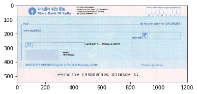

# SBI CHEQUE VALIDATION USING DEEP NEURAL NETWROK

##                                                        TEAM
###                                           ANUBHAV, VIJENDRA, NEERAJ , ASHUTOSH

## HOW TO RUN:-

### to combine splited files in windows

cd into yolo-data
copy /b file1 + file2 + file3 + file4 filetogether.tar.gz
uncompress filetogether.tar.gz


### How to combine splited files in Ubuntu
cd into yolo-data
cat final-data.tar.gz* | tar xz


### How to  split  big files in Ubuntu
tar cvzf - final-data | split -b 10m - final-data.tar.gz


### darknet commands and YOLO for object detecction
yolo training on 3000 images and with 8000 iteration  

Currently training is still going  on GPU cluster in background mode, lets see after 1 day:-
/datadrive/NeerajAg/yolo/darknet

We tried pretrain darknet model to train further using below command:-
https://pjreddie.com/darknet/yolo/

train:-
./darknet detector train cfg/obj.data cfg/yolo.cfg darknet19_448.conv.23
nohup  ./darknet detector train cfg/obj.data cfg/yolo.cfg  backup/yolo.backup  > training.log &

Test:-
./darknet detector test cfg/obj.data  cfg/yolo.cfg backup/yolo-obj_final.weights /home/ashutosh/sentienceWork/darknet/final-data/final-image-0.jpg -thresh 0

See yolo training log 
Region Avg IOU: 0.481528, Class: 0.994299, Obj: 0.242427, No Obj: 0.004990, Avg Recall: 0.333333,  count: 3
7556: 9.163102, 6.318862 avg, 0.001000 rate, 0.095384 seconds, 7556 images
Loaded: 0.000055 seconds

6.318862 avg loss is too high as per yolo it should be below 0.06 to 0.6

./darknet detector train cfg/obj.data  cfg/yolo-obj.cfg yolo.weights

/home/ashutosh/sentienceWork/darknet/final-data/final-image-0.jpg


/darknet detector train cfg/obj.data cfg/yolo.cfg darknet19_448.conv.23

./darknet detector test cfg/obj.data  cfg/yolo.cfg backup/yolo-obj_final.weights /home/ashutosh/sentienceWork/darknet/final-data/final-image-0.jpg -thresh 0


```python
import cv2
import matplotlib.pyplot as plt
import matplotlib.image as mpimg
%matplotlib inline

```

## Adding Amount in words


```python
s_img = cv2.imread("in-words-images-transparentBG/0.png", -1)

height, width = s_img.shape[:2]

s_img2 = cv2.resize(s_img, (int(width/1.5), int(height/1.5)), interpolation = cv2.INTER_AREA)

plt.imshow( s_img2)
```


    <matplotlib.image.AxesImage at 0x7faefaf172e8>


```python
plt.imshow( s_img)
```


    <matplotlib.image.AxesImage at 0x7faefae574e0>


```python
s_img=s_img2
```


```python
l_img = cv2.imread("cheque.jpg")
l_img = cv2.cvtColor(l_img, cv2.COLOR_BGR2RGB)
plt.imshow( l_img)
```


    <matplotlib.image.AxesImage at 0x7faefade21d0>


```python

height2, width2 = l_img.shape[:2]
dst = cv2.resize(l_img, (2*width2, 2*height2), interpolation = cv2.INTER_CUBIC)
plt.imshow( dst)
```


    <matplotlib.image.AxesImage at 0x7faef939a908>


```python


x_offset= 200 
y_offset=150
#l_img[y_offset:y_offset+s_img.shape[0], x_offset:x_offset+s_img.shape[1]] = s_img

#s_img = cv2.imread("smaller_image.png")

y1, y2 = y_offset, y_offset + s_img.shape[0]
x1, x2 = x_offset, x_offset + s_img.shape[1]

alpha_s = s_img[:, :, 3] / 255.0
alpha_l = 1.0 - alpha_s
dst2=dst
for c in range(0, 3):
    dst2[y1:y2, x1:x2, c] = (alpha_s * s_img[:, :, c] +
                              alpha_l * dst2[y1:y2, x1:x2, c])
    
plt.imshow( dst2)
```


    <matplotlib.image.AxesImage at 0x7faef91524a8>


## Adding number in box


```python
num_img = cv2.imread("Combined_transparent/number_0.png", cv2.IMREAD_GRAYSCALE)

height, width = num_img.shape[:2]
#num_img = cv2.resize(num_img, (int(width/2), int(height/2)), interpolation = cv2.INTER_AREA)
print(num_img.shape)
#num_img_show = cv2.cvtColor(num_img,cv2.IMREAD_GRAYSCALE)
plt.imshow( num_img ,cmap='gray')

```

    (28, 141)


    <matplotlib.image.AxesImage at 0x7faef905f9b0>


```python
x_offset= 930 
y_offset=200
#l_img[y_offset:y_offset+s_img.shape[0], x_offset:x_offset+s_img.shape[1]] = s_img

#s_img = cv2.imread("smaller_image.png")

y1, y2 = y_offset, y_offset + num_img.shape[0]
x1, x2 = x_offset, x_offset + num_img.shape[1]

alpha_s = num_img[:, :] / 255.0
alpha_l = 1.0 - alpha_s
dst3=dst2
for c in range(0, 3):
    dst3[y1:y2, x1:x2, c] = (alpha_l * num_img[:, :] +
                              alpha_s * dst3[y1:y2, x1:x2, c])
    


plt.imshow( dst3)
dst4 = cv2.cvtColor(dst3, cv2.COLOR_BGR2RGB)
cv2.imwrite("final-image.jpg", dst4)

```


    True





```python
#dst2 = cv2.cvtColor(dst2, cv2.COLOR_RGB2BGR)
```


```python
cv2.imwrite("final-image.jpg", dst3)
```


    True


# adding date


```python
from PIL import Image
import os

folder_path_input = "dates/"
folder_path_output= "dates-transparentBG/"

"""

image_names =os.listdir(folder_path_input)

for img_name in image_names:
    print (img_name)
    img = Image.open(folder_path_input+img_name)
    img = img.convert("LA")
    datas = img.getdata()

    newData = []
    for item in datas:
        if item[0] == 255 :
            newData.append((255,  0))
        else:
            newData.append(item)
    #os.chdir(folder_path_output)
    img.putdata(newData)
    img.save(folder_path_output+img_name, "PNG")
"""
```


    '\n\nimage_names =os.listdir(folder_path_input)\n\nfor img_name in image_names:\n    print (img_name)\n    img = Image.open(folder_path_input+img_name)\n    img = img.convert("LA")\n    datas = img.getdata()\n\n    newData = []\n    for item in datas:\n        if item[0] == 255 :\n            newData.append((255,  0))\n        else:\n            newData.append(item)\n    #os.chdir(folder_path_output)\n    img.putdata(newData)\n    img.save(folder_path_output+img_name, "PNG")\n'


```python

```


```python
date_img = cv2.imread("dates-transparentBG/date_0.png",  cv2.IMREAD_GRAYSCALE)

height, width = date_img.shape[:2]
date_img = cv2.resize(date_img, (int(width/1.5), int(height/1)), interpolation = cv2.INTER_AREA)
plt.imshow( date_img ,cmap='gray')

```


    <matplotlib.image.AxesImage at 0x7faef8f7ceb8>


```python
x_offset= 930 
y_offset=40
#l_img[y_offset:y_offset+s_img.shape[0], x_offset:x_offset+s_img.shape[1]] = s_img

#s_img = cv2.imread("smaller_image.png")

y1, y2 = y_offset, y_offset + date_img.shape[0]
x1, x2 = x_offset, x_offset + date_img.shape[1]

alpha_s = date_img[:, :] / 255.0
alpha_l = 1.0 - alpha_s
dst4=dst3
for c in range(0, 3):
    dst4[y1:y2, x1:x2, c] = (alpha_l * date_img[:, :] +
                              alpha_s * dst3[y1:y2, x1:x2, c])
    


plt.imshow( dst4)
dst5 = cv2.cvtColor(dst4, cv2.COLOR_BGR2RGB)
cv2.imwrite("final-image.jpg", dst5)
```


    True


```python
 import csv
```


```python
with open('details3.csv', 'r') as csvfile:
    spamreader = csv.reader(csvfile, delimiter=',')
    header = True
    for row in spamreader:
        if(header):
            header = False
            continue
        print( row)
        break
```

    ['0', '0', 'b_car_003001.png', '32936', 'Thirty Two Thousand Nine Hundred Thirty Six only', '0', 'number_0.png', '1552017', 'date_0.png']


```python
with open('final-data.csv', 'w') as csvfile:
    writer = csv.writer(csvfile, delimiter=',')
    with open('details3.csv', 'r') as csvfile2:
        spamreader = csv.reader(csvfile2, delimiter=',')
        header = True
        for row in spamreader:
            if(header):
                header = False
                continue
            else:
                #print( row)
                try:
                    l_img = cv2.imread("cheque.jpg")
                    l_img = cv2.cvtColor(l_img, cv2.COLOR_BGR2RGB)
                    height2, width2 = l_img.shape[:2]
                    dst = cv2.resize(l_img, (2*width2, 2*height2), interpolation = cv2.INTER_CUBIC)
                    
                    s_img = cv2.imread("in-words-images-transparentBG/" +row[0]+".png", -1)

                    height, width = s_img.shape[:2]

                    s_img2 = cv2.resize(s_img, (int(width/1.5), int(height/1.5)), interpolation = cv2.INTER_AREA)

                    x_offset= 200 
                    y_offset=150
                    #l_img[y_offset:y_offset+s_img.shape[0], x_offset:x_offset+s_img.shape[1]] = s_img

                    #s_img = cv2.imread("smaller_image.png")

                    y1, y2 = y_offset, y_offset + s_img2.shape[0]
                    x1, x2 = x_offset, x_offset + s_img2.shape[1]

                    alpha_s = s_img2[:, :, 3] / 255.0
                    alpha_l = 1.0 - alpha_s
                    dst2=dst
                    for c in range(0, 3):
                        dst2[y1:y2, x1:x2, c] = (alpha_s * s_img2[:, :, c] +
                                                  alpha_l * dst2[y1:y2, x1:x2, c])

                    row=row+["box1",x1,y1,x2,y2]
                    #print(x1,y1,x2,y2)

                    ####################################
                    num_img = cv2.imread("Combined_transparent/" +row[6], cv2.IMREAD_GRAYSCALE)

                    height, width = num_img.shape[:2]
                    x_offset= 930 
                    y_offset=200
                    #l_img[y_offset:y_offset+s_img.shape[0], x_offset:x_offset+s_img.shape[1]] = s_img

                    #s_img = cv2.imread("smaller_image.png")

                    y1, y2 = y_offset, y_offset + num_img.shape[0]
                    x1, x2 = x_offset, x_offset + num_img.shape[1]

                    alpha_s = num_img[:, :] / 255.0
                    alpha_l = 1.0 - alpha_s
                    dst3=dst2
                    for c in range(0, 3):
                        dst3[y1:y2, x1:x2, c] = (alpha_l * num_img[:, :] +
                                                  alpha_s * dst3[y1:y2, x1:x2, c])

                    row=row+["box2",x1,y1,x2,y2]
                    #print(x1,y1,x2,y2)
                    ####################################
                    date_img = cv2.imread("dates-transparentBG/" +row[8],  cv2.IMREAD_GRAYSCALE)

                    height, width = date_img.shape[:2]
                    date_img = cv2.resize(date_img, (int(width/1.5), int(height/1)), interpolation = cv2.INTER_AREA)
                    x_offset= 930 
                    y_offset=40
                    #l_img[y_offset:y_offset+s_img.shape[0], x_offset:x_offset+s_img.shape[1]] = s_img

                    #s_img = cv2.imread("smaller_image.png")

                    y1, y2 = y_offset, y_offset + date_img.shape[0]
                    x1, x2 = x_offset, x_offset + date_img.shape[1]

                    alpha_s = date_img[:, :] / 255.0
                    alpha_l = 1.0 - alpha_s
                    dst4=dst3
                    for c in range(0, 3):
                        dst4[y1:y2, x1:x2, c] = (alpha_l * date_img[:, :] +
                                                  alpha_s * dst4[y1:y2, x1:x2, c])

                    row=row+["box3",x1,y1,x2,y2]
                    #print(x1,y1,x2,y2)
                    #plt.imshow( dst4)
                    dst5 = cv2.cvtColor(dst4, cv2.COLOR_BGR2RGB)
                    cv2.imwrite("final-data/final-image-"+row[0]+".jpg", dst5)
                    row=row+["final-data/final-image-"+row[0]+".jpg"]
                    writer.writerow(row)
                    #break
                except :
                        print("issue occured")
                        pass
                #break
```

# building train config file for yolo

## Average width hight


```python
from PIL import Image
with open('final-data.csv', 'r') as csvfile:
    spamreader = csv.reader(csvfile, delimiter=',')
    header = True
    
    im=Image.open("final-data/final-image-0.jpg")
    w= int(im.size[0])
    h= int(im.size[1])
    dw = 1./w
    dh = 1./h
    for row in spamreader:
        """
        if(header):
            header = False
            print( row)
            continue
        else:
            print( row)
            break
        """
        
        #print( row)
        #print( row[9])
        #print( row[14])
        #print( row[19])
        with open("final-data-txt/final-image-"+row[0]+'.txt', 'w') as csvfile2:
           
            x = (int(row[10]) + int(row[12]))/2.0
            y = (int(row[11]) + int(row[13]))/2.0
            w = int(row[12] )- int(row[10])
            h = int(row[13]) - int(row[11])
            x = x*dw
            w = w*dw
            y = y*dh
            h = h*dh
            #print(x,y,w,h)
            writer = csv.writer(csvfile2, delimiter=' ')
            writeRow=[0]+[x,y,w,h]
            writer.writerow(writeRow)
            
            x = (int(row[10+5]) + int(row[12+5]))/2.0
            y = (int(row[11+5]) + int(row[13+5]))/2.0
            w = int(row[12+5] )- int(row[10+5])
            h = int(row[13+5]) - int(row[11+5])
            x = x*dw
            w = w*dw
            y = y*dh
            h = h*dh
            #print(x,y,w,h)
            writer = csv.writer(csvfile2, delimiter=' ')
            writeRow=[1]+[x,y,w,h]
            writer.writerow(writeRow)
            
            x = (int(row[10+5+5]) + int(row[12+5+5]))/2.0
            y = (int(row[11+5+5]) + int(row[13+5+5]))/2.0
            w = int(row[12+5+5] )- int(row[10+5+5])
            h = int(row[13+5+5]) - int(row[11+5+5])
            x = x*dw
            w = w*dw
            y = y*dh
            h = h*dh
            #print(x,y,w,h)
            writer = csv.writer(csvfile2, delimiter=' ')
            writeRow=[2]+[x,y,w,h]
            writer.writerow(writeRow)
            #break
```

## Absolute width height


```python
from PIL import Image
with open('final-data.csv', 'r') as csvfile:
    spamreader = csv.reader(csvfile, delimiter=',')
    header = True
    
    im=Image.open("final-data/final-image-0.jpg")
    w= int(im.size[0])
    h= int(im.size[1])
    dw = 1./w
    dh = 1./h
    for row in spamreader:
        """
        if(header):
            header = False
            print( row)
            continue
        else:
            print( row)
            break
        """
        
        #print( row)
        #print( row[9])
        #print( row[14])
        #print( row[19])
        with open("final-data-txt/final-image-"+row[0]+'.txt', 'w') as csvfile2:
           
            x = (int(row[10]) + int(row[12]))/2.0
            y = (int(row[11]) + int(row[13]))/2.0
            w = int(row[12] )- int(row[10])
            h = int(row[13]) - int(row[11])
            #x = x*dw
            #w = w*dw
            #y = y*dh
            #h = h*dh
            #print(x,y,w,h)
            writer = csv.writer(csvfile2, delimiter=' ')
            writeRow=[0]+[x,y,w,h]
            writer.writerow(writeRow)
            
            x = (int(row[10+5]) + int(row[12+5]))/2.0
            y = (int(row[11+5]) + int(row[13+5]))/2.0
            w = int(row[12+5] )- int(row[10+5])
            h = int(row[13+5]) - int(row[11+5])
            #x = x*dw
            #w = w*dw
            #y = y*dh
            #h = h*dh
            #print(x,y,w,h)
            writer = csv.writer(csvfile2, delimiter=' ')
            writeRow=[1]+[x,y,w,h]
            writer.writerow(writeRow)
            
            x = (int(row[10+5+5]) + int(row[12+5+5]))/2.0
            y = (int(row[11+5+5]) + int(row[13+5+5]))/2.0
            w = int(row[12+5+5] )- int(row[10+5+5])
            h = int(row[13+5+5]) - int(row[11+5+5])
            #x = x*dw
            #w = w*dw
            #y = y*dh
            #h = h*dh
            #print(x,y,w,h)
            writer = csv.writer(csvfile2, delimiter=' ')
            writeRow=[2]+[x,y,w,h]
            writer.writerow(writeRow)
            #break
```

## building test and train data for YOLO


```python
import glob, os

# Current directory
current_dir = os.path.dirname(os.path.abspath('final-data/final-image-0.jpg'))
print(current_dir)
# Directory where the data will reside, relative to 'darknet.exe'
path_data = 'final-data/'

# Percentage of images to be used for the test set
percentage_test = 10;

# Create and/or truncate train.txt and test.txt
file_train = open('train.txt', 'w')  
file_test = open('test.txt', 'w')

# Populate train.txt and test.txt
counter = 1  
index_test = round(100 / percentage_test)  
for pathAndFilename in glob.iglob(os.path.join(current_dir, "*.jpg")):  
    title, ext = os.path.splitext(os.path.basename(pathAndFilename))

    if counter == index_test:
        counter = 1
        file_test.write(path_data + title + '.jpg' + "\n")
    else:
        file_train.write(path_data + title + '.jpg' + "\n")
        counter = counter + 1
```

    /home/ashutosh/sentienceWork/magnet/final-data


```python

```
